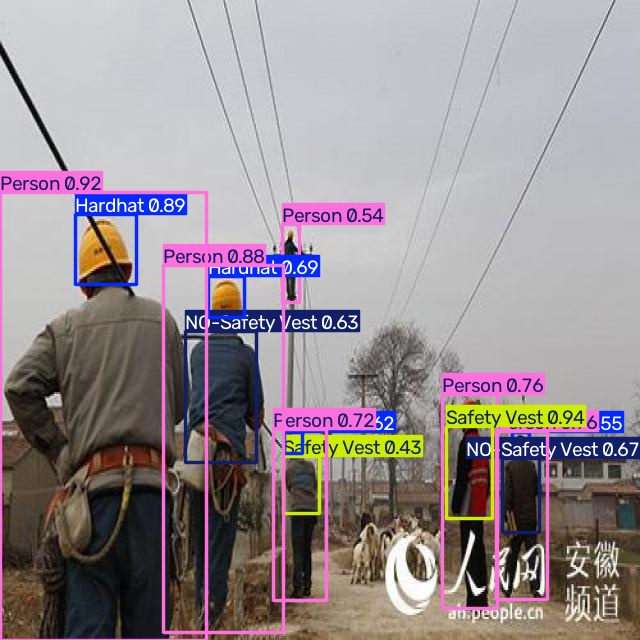
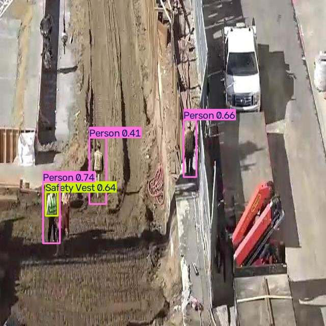
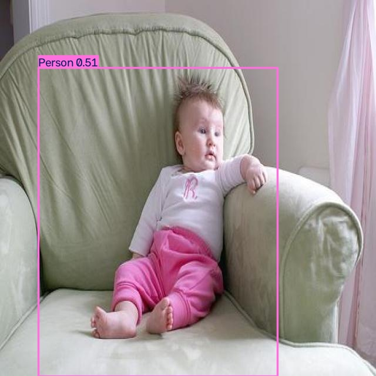
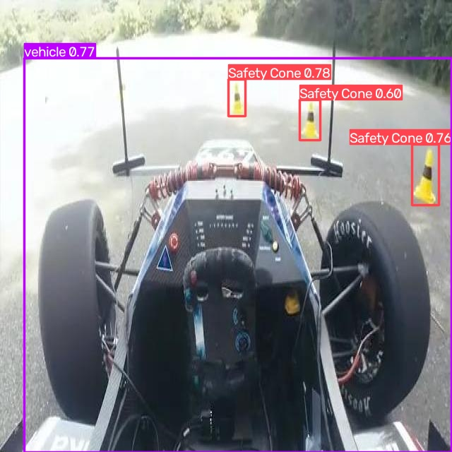
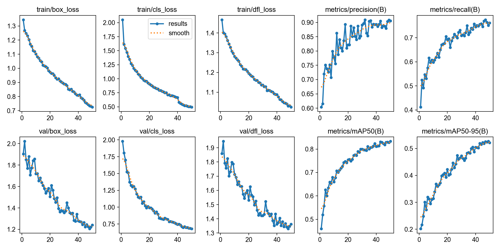
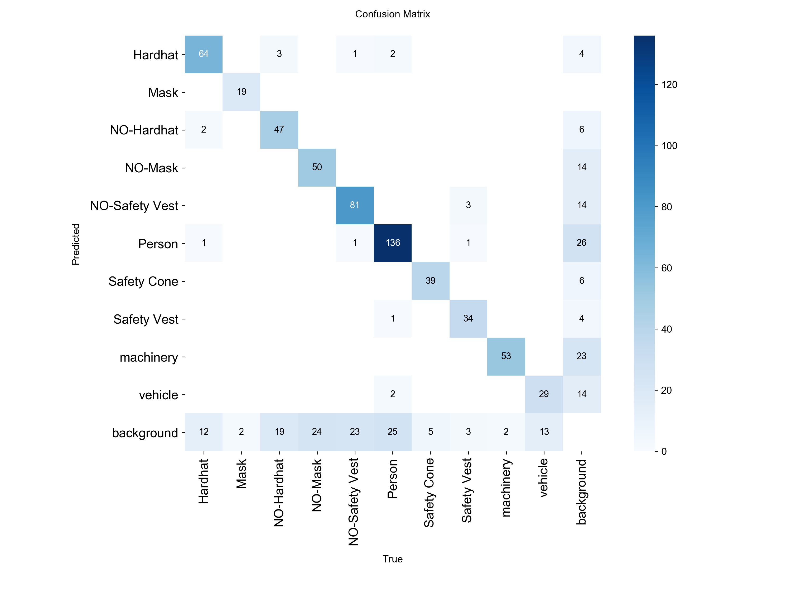

# Custom YOLOv8 PPE Safety Detection

This project is a custom YOLOv8 object detection pipeline for construction site safety monitoring.

It focuses on detecting personal protective equipment (PPE) and safety-related objects in construction environments, including hardhats, masks, safety vests, people, vehicles, machinery, and safety cones.

The project demonstrates a complete computer vision workflow:

- Dataset preparation
- Custom YOLOv8 training
- Model evaluation
- Prediction visualization
- Confidence threshold comparison
- Model packaging
- GitHub project presentation

---

## Project Highlights

- Custom YOLOv8s model trained for PPE safety detection
- Supports 10 construction safety-related classes
- Includes training, evaluation, and prediction scripts
- Includes trained best model weights
- Includes model performance results
- Includes training curves and confusion matrix
- Includes prediction examples
- Designed as a practical computer vision engineering portfolio project

---

## Classes

The model detects the following 10 classes:

```text
Hardhat
Mask
NO-Hardhat
NO-Mask
NO-Safety Vest
Person
Safety Cone
Safety Vest
machinery
vehicle
```

---

## Model Performance

The best YOLOv8s model achieved the following validation results:

| Metric | Score |
|---|---:|
| Precision | 0.894 |
| Recall | 0.764 |
| mAP50 | 0.831 |
| mAP50-95 | 0.526 |

### Per-Class Performance

| Class | Precision | Recall | mAP50 | mAP50-95 |
|---|---:|---:|---:|---:|
| Hardhat | 0.952 | 0.753 | 0.887 | 0.580 |
| Mask | 0.983 | 0.905 | 0.935 | 0.643 |
| NO-Hardhat | 0.857 | 0.606 | 0.693 | 0.369 |
| NO-Mask | 0.869 | 0.622 | 0.672 | 0.377 |
| NO-Safety Vest | 0.904 | 0.711 | 0.794 | 0.483 |
| Person | 0.877 | 0.783 | 0.861 | 0.564 |
| Safety Cone | 0.901 | 0.886 | 0.904 | 0.503 |
| Safety Vest | 0.971 | 0.820 | 0.939 | 0.654 |
| machinery | 0.810 | 0.930 | 0.941 | 0.662 |
| vehicle | 0.818 | 0.619 | 0.686 | 0.429 |

---

## Detection Results

### Example 1



### Example 2



### Example 3



### Example 4



---

## Training Results

### Training Curves



### Confusion Matrix



---

## Project Structure

```text
custom-yolo-ppe-safety-detection/
├── assets/
│   ├── ppe_result_1.jpg
│   ├── ppe_result_2.jpg
│   ├── ppe_result_3.jpg
│   ├── ppe_result_4.jpg
│   ├── training_results_yolov8s.png
│   └── confusion_matrix_yolov8s.png
├── weights/
│   ├── ppe_yolov8s_best_map083.pt
│   └── ppe_yolov8s_best_map083_results.csv
├── train.py
├── evaluate.py
├── predict.py
├── detect_cli.py
├── predict_conf_compare.py
├── compare_conf_images.py
├── requirements.txt
├── README.md
└── .gitignore
```

---

## Installation

Clone this repository:

```bash
git clone https://github.com/ACCATH/custom-yolo-ppe-safety-detection.git
cd custom-yolo-ppe-safety-detection
```

Install dependencies:

```bash
pip install -r requirements.txt
```

---

## Dataset

The dataset is not included in this repository because of file size considerations.

This project uses a YOLO-format construction site safety dataset with the following structure:

```text
datasets/
└── construction_site_safety/
    ├── train/
    │   ├── images/
    │   └── labels/
    ├── valid/
    │   ├── images/
    │   └── labels/
    ├── test/
    │   ├── images/
    │   └── labels/
    └── data.yaml
```

Example `data.yaml`:

```yaml
path: datasets/construction_site_safety

train: train/images
val: valid/images
test: test/images

nc: 10

names:
  0: Hardhat
  1: Mask
  2: NO-Hardhat
  3: NO-Mask
  4: NO-Safety Vest
  5: Person
  6: Safety Cone
  7: Safety Vest
  8: machinery
  9: vehicle
```

---

## Training

To train the model:

```bash
python train.py
```

The current best training configuration:

```text
Model: YOLOv8s
Epochs: 50
Image size: 640
Batch size: 16
Device: CUDA GPU
```

The trained model and results will be saved to the training output directory.

---

## Evaluation

To evaluate the trained model:

```bash
python evaluate.py
```

The evaluation script calculates detection metrics such as:

- Precision
- Recall
- mAP50
- mAP50-95

---

## Prediction

To run prediction with the included best model:

```bash
python predict.py
```

The included best model is located at:

```text
weights/ppe_yolov8s_best_map083.pt
```

The default confidence threshold is set to:

```text
0.35
```

This threshold was selected to balance missed detections and false positives.

---

## Confidence Threshold Comparison

This project also includes a confidence threshold comparison script:

```bash
python predict_conf_compare.py
```

It can test multiple confidence thresholds, such as:

```text
0.25
0.35
0.50
```

A lower confidence threshold may detect more objects but can introduce more false positives.

A higher confidence threshold produces cleaner results but may miss uncertain or small objects.

To combine corresponding prediction images into side-by-side comparison images, run:

```bash
python compare_conf_images.py
```

---

## Best Model

The best trained model is included at:

```text
weights/ppe_yolov8s_best_map083.pt
```

The training result CSV is included at:

```text
weights/ppe_yolov8s_best_map083_results.csv
```

---

## Notes

This project is intended as a practical computer vision engineering portfolio project.

It demonstrates the full workflow of custom object detection, including:

```text
Dataset preparation
YOLO model training
Model evaluation
Prediction visualization
Confidence threshold analysis
Model packaging
GitHub project presentation
```

---

## Future Improvements

Potential future improvements include:

- Training YOLOv8s for more epochs
- Testing larger input sizes such as 768
- Comparing YOLOv8n, YOLOv8s, and YOLOv8m
- Improving recall for NO-Hardhat, NO-Mask, and vehicle classes
- Adding automatic Excel detection reports
- Deploying the model with a simple web interface or API
- Building a client-friendly batch detection tool

---

## License

This project is for learning, research, and portfolio demonstration purposes.